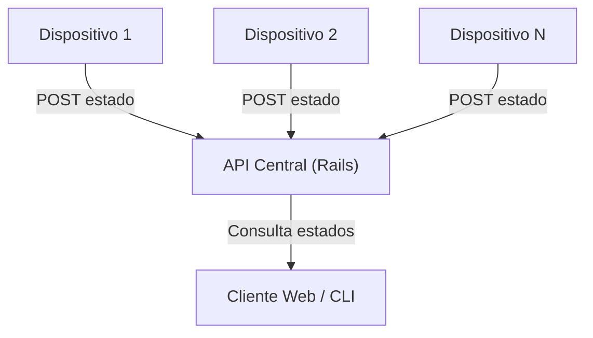
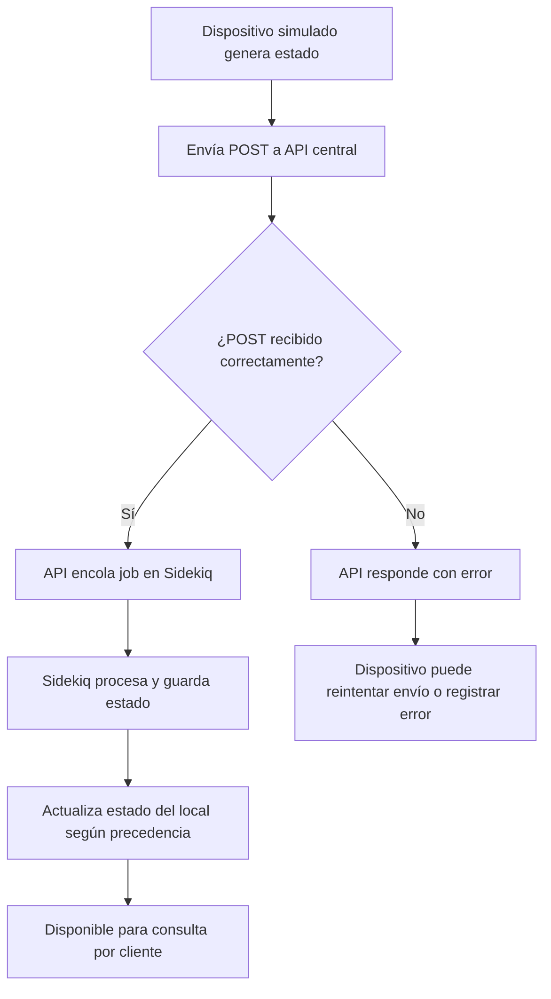

# NIU Foods - Sistema de Monitoreo de Dispositivos

Este proyecto simula un sistema de monitoreo de dispositivos distribuidos en diferentes locales, centralizando la información en una API. Permite observar el estado de cada dispositivo y local, facilitando la gestión y el diagnóstico de problemas en tiempo real.

## Arquitectura del Proyecto

- **Backend (API central):** Aplicación Rails que expone endpoints para recibir y consultar el estado de los dispositivos.
- **Simulador de Dispositivos:** Script que emula la actividad y los estados de los dispositivos, enviando datos periódicamente a la API.
- **Cliente (opcional):** Interfaz para visualizar el estado de los locales y dispositivos (si está implementada).

Todo el entorno se ejecuta en contenedores Docker para asegurar portabilidad y facilidad de despliegue.

---

## Lógica de Actualización de Estados y Mantenimiento

La lógica del negocio implementada en los modelos de la aplicación Rails asegura que las actualizaciones de estado de los dispositivos y la gestión de los registros de mantenimiento se reflejen correctamente en el sistema:

- **Actualización de Estado de Dispositivos:**  
    Cada vez que un dispositivo reporta un nuevo estado, el modelo correspondiente actualiza su registro en la base de datos. Si el dispositivo entra en mantenimiento (`in_maintenance`), se crea un registro de mantenimiento asociado, indicando el inicio del proceso.

- **Gestión de Registros de Mantenimiento:**  
    Los registros de mantenimiento permiten llevar un historial de cuándo un dispositivo entra y sale de mantenimiento. Cuando un dispositivo sale de mantenimiento y vuelve a un estado operativo, el registro se actualiza para reflejar la finalización del mantenimiento.

- **Impacto en el Estado del Restaurante:**  
    La lógica de precedencia en el modelo del restaurante evalúa el estado global considerando tanto los estados normales (`operative`, `failing`, `trouble`, `unknown`) como los de mantenimiento. Si algún dispositivo está en `failing`, el restaurante se marca como `failing`. Si no hay dispositivos en `failing` pero sí en `trouble`, el restaurante se marca como `trouble`. Los dispositivos en `in_maintenance` no afectan negativamente el estado global, permitiendo que el restaurante se considere `operative` si los demás dispositivos están en buen estado o en mantenimiento.

- **Consistencia y Automatización:**  
    Toda esta lógica se encuentra encapsulada en los modelos, utilizando callbacks y métodos personalizados para asegurar que cualquier cambio de estado o registro de mantenimiento actualice automáticamente el estado global del restaurante y el historial de mantenimiento de los dispositivos.

---

## Diagrama General de Conexión



- Cada dispositivo simulado genera eventos de estado y los envía mediante peticiones HTTP a la API central.
- La API central almacena y procesa los estados recibidos.
- El cliente (opcional) consulta la API para mostrar el estado actualizado de los dispositivos y locales.

---



- Los dispositivos simulan cambios de estado y envían los datos a la API.
- La API valida la estructura y contenido del mensaje.
- Si es válido, almacena el estado y actualiza el estado global del local según la lógica de precedencia.
- Si ocurre un error (por ejemplo, datos inválidos), la API responde con un mensaje de error y el dispositivo puede reintentar o registrar el fallo.

---

## Pasos para Ejecutar el Proyecto

1. **Requisitos previos**
     - Tener Docker instalado (versión >= 28).

2. **Clonar el repositorio**
     ```sh
     git clone <URL_DEL_REPOSITORIO>
     cd niufoods-test
     ```

3. **Iniciar los servicios**
     ```sh
     docker-compose up
     ```
     Esto levantará la API central y los servicios necesarios.

4. **Ejecutar la simulación de dispositivos**
     ```sh
     docker-compose run --rm backend bundle exec rails runner simulate_device_activity.rb
     ```
     Esto iniciará el script que simula la actividad de los dispositivos y enviará los datos a la API.

5. **(Opcional) Iniciar el cliente**
     - Si existe una interfaz cliente, puedes iniciarla con:
         ```sh
         docker-compose up client
         ```

---

## Comandos Útiles

| Comando                                      | Alias                    | Descripción                                                                                      |
|----------------------------------------------|--------------------------|--------------------------------------------------------------------------------------------------|
| `docker-compose up`                          | `dcup`                   | Inicia el entorno de desarrollo (todos los servicios)                                            |
| `docker-compose stop`                        | `dcstop`                 | Detiene el entorno de desarrollo (todos los servicios)                                           |
| `docker-compose up backend`                  | `dcup backend`           | Inicia solo el backend (API)                                                                     |
| `docker-compose up backend client`           | `dcup backend client`    | Inicia tanto el backend como el cliente                                                          |
| `docker-compose ps`                          | `dcps`                   | Muestra el estado de los contenedores en ejecución                                               |
| `docker-compose exec backend bash`           | `dce backend bash`       | Abre una terminal dentro del contenedor                                                          |
| `docker-compose exec backend rails c`        | `dce backend rails c`    | Abre la consola de Rails dentro del contenedor                                                   |
| `docker-compose exec backend {comando}`      | `dce backend {comando}`  | Ejecuta cualquier comando dentro de un contenedor en particular                                  |
| `docker-compose run backend {comando}`       | `dcr backend {comando}`  | Ejecuta cualquier comando dentro de un contenedor y lo inicia automáticamente                    |

### Nota sobre el levantamiento del proyecto

Para asegurar que los contenedores se construyan con la última versión de la imagen y se ejecuten en segundo plano, se recomienda iniciar los servicios con:

```sh
docker-compose up -d --build
```

- El flag `--build` fuerza la reconstrucción de las imágenes, útil si hubo cambios en el código o dependencias.
- El flag `-d` ejecuta los servicios en modo "detached" (en segundo plano).

Puedes omitir `--build` si no hubo cambios recientes, y `-d` si prefieres ver los logs en la terminal.

## Consideraciones

- **Variables y configuración:** Los archivos de configuración y variables incluidos son solo para facilitar la revisión. **No** los uses en proyectos reales o entornos productivos.
- **Persistencia:** Los datos se almacenan en la base de datos definida en el entorno Docker.
- **Lógica de precedencia:** El estado global de un local se determina por el estado más severo de sus dispositivos:
    - Si algún dispositivo está en `failing`, el local está en `failing`.
    - Si no hay `failing` pero sí `trouble`, el local está en `trouble`.
    - Solo si todos los dispositivos están en `operative`, `in_maintenance` o `unknown`, el local se considera `operative`.
- **Errores:** Si la API recibe datos inválidos, responde con un error y no almacena la información.
- **Portabilidad:** Todo el entorno está preparado para ejecutarse en cualquier máquina con Docker.

---

¿Dudas o sugerencias? ¡Contribuciones y mejoras son bienvenidas!

